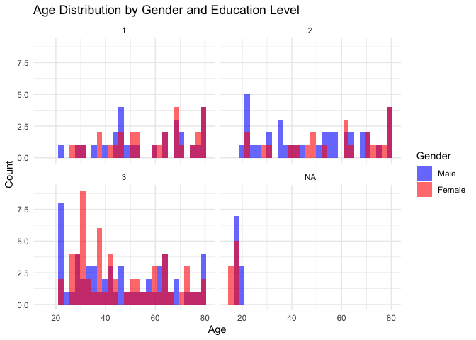
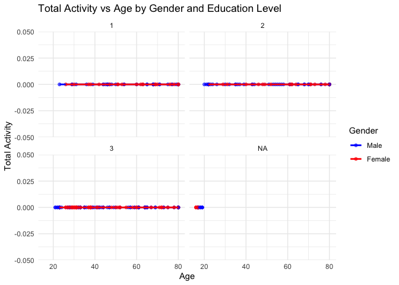
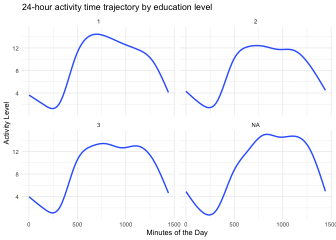
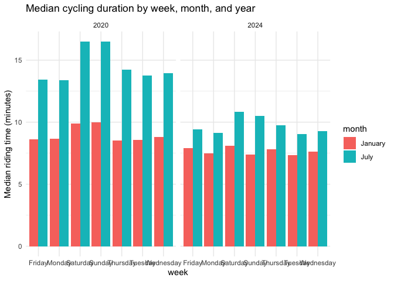
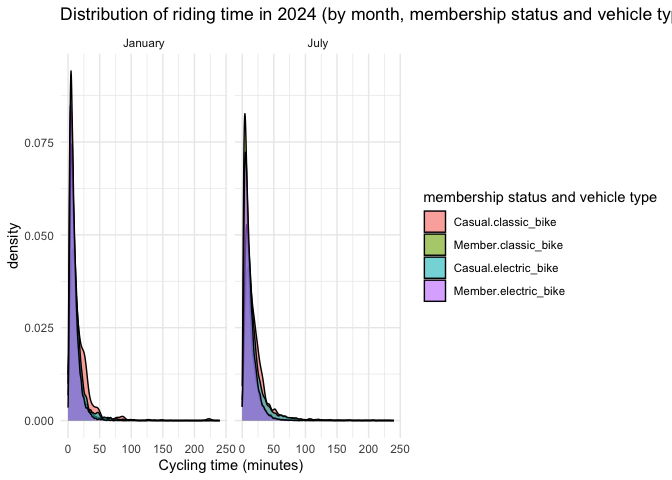

p8105_hw3_cr3442
================
Cheng Rao
2024-10-15

First of all, let me explain why I did not submit multiple versions of
the assignment and did not reflect my modification process. It is like
this. I had completed part of my assignment before this week, but did
not commit or push. Last Saturday, my original computer broke down. I
tried to fix the computer during the weekend but failed. For this
reason, I used my classmate’s computer to complete this week’s homework,
so I did not submit the previous modification process (because I can’t
use icloud). And I feel that I can’t submit my code through the push
method that comes with R studio, but need to submit it by manually
adding it on github. I am very sorry for the trouble caused to you in
correcting your homework.

# Problem 2

``` r
library(tidyverse)
```

    ## ── Attaching core tidyverse packages ──────────────────────── tidyverse 2.0.0 ──
    ## ✔ dplyr     1.1.4     ✔ readr     2.1.5
    ## ✔ forcats   1.0.0     ✔ stringr   1.5.1
    ## ✔ ggplot2   3.5.1     ✔ tibble    3.2.1
    ## ✔ lubridate 1.9.3     ✔ tidyr     1.3.1
    ## ✔ purrr     1.0.2     
    ## ── Conflicts ────────────────────────────────────────── tidyverse_conflicts() ──
    ## ✖ dplyr::filter() masks stats::filter()
    ## ✖ dplyr::lag()    masks stats::lag()
    ## ℹ Use the conflicted package (<http://conflicted.r-lib.org/>) to force all conflicts to become errors

``` r
library(readr)
```

To solve this problem, first let us load the two required datasets, and
check them to make sure they are OK.

``` r
getwd()
```

    ## [1] "/Users/raocheng/Desktop/p8105_hw3_cr3442"

``` r
demographics <- read_csv("/Users/raocheng/Desktop/p8105_hw3_cr3442/data/demographics.csv")
```

    ## New names:
    ## Rows: 254 Columns: 5
    ## ── Column specification
    ## ──────────────────────────────────────────────────────── Delimiter: "," chr
    ## (5): ...1, 1 = male, ...3, ...4, 1 = Less than high school
    ## ℹ Use `spec()` to retrieve the full column specification for this data. ℹ
    ## Specify the column types or set `show_col_types = FALSE` to quiet this message.
    ## • `` -> `...1`
    ## • `` -> `...3`
    ## • `` -> `...4`

``` r
accelerometer <- read_csv("/Users/raocheng/Desktop/p8105_hw3_cr3442/data/accelerometer.csv")
```

    ## Rows: 250 Columns: 1441
    ## ── Column specification ────────────────────────────────────────────────────────
    ## Delimiter: ","
    ## dbl (1441): SEQN, min1, min2, min3, min4, min5, min6, min7, min8, min9, min1...
    ## 
    ## ℹ Use `spec()` to retrieve the full column specification for this data.
    ## ℹ Specify the column types or set `show_col_types = FALSE` to quiet this message.

``` r
# Preview the first few rows of each dataset
head(demographics)
```

    ## # A tibble: 6 × 5
    ##   ...1  `1 = male` ...3  ...4  `1 = Less than high school`
    ##   <chr> <chr>      <chr> <chr> <chr>                      
    ## 1 <NA>  2 = female <NA>  <NA>  2 =  High school equivalent
    ## 2 <NA>  <NA>       <NA>  <NA>  3  = More than high school 
    ## 3 <NA>  <NA>       <NA>  <NA>  <NA>                       
    ## 4 SEQN  sex        age   BMI   education                  
    ## 5 62161 1          22    23.3  2                          
    ## 6 62164 2          44    23.2  3

``` r
head(accelerometer)
```

    ## # A tibble: 6 × 1,441
    ##    SEQN  min1  min2  min3  min4   min5   min6  min7   min8    min9  min10  min11
    ##   <dbl> <dbl> <dbl> <dbl> <dbl>  <dbl>  <dbl> <dbl>  <dbl>   <dbl>  <dbl>  <dbl>
    ## 1 62161 1.11  3.12  1.47  0.938 1.60   0.145  2.10  0.509   1.63   1.20   0.947 
    ## 2 62164 1.92  1.67  2.38  0.935 2.59   5.22   2.39  4.90    1.97   3.13   2.77  
    ## 3 62169 5.85  5.18  4.76  6.48  6.85   7.24   6.12  7.48    5.47   6.49   5.14  
    ## 4 62174 5.42  3.48  3.72  3.81  6.85   4.45   0.561 1.61    0.698  2.72   4.85  
    ## 5 62177 6.14  8.06  9.99  6.60  4.57   2.78   7.10  7.25   10.1    7.49   2.72  
    ## 6 62178 0.167 0.429 0.131 1.20  0.0796 0.0487 0.106 0.0653  0.0564 0.0639 0.0909
    ## # ℹ 1,429 more variables: min12 <dbl>, min13 <dbl>, min14 <dbl>, min15 <dbl>,
    ## #   min16 <dbl>, min17 <dbl>, min18 <dbl>, min19 <dbl>, min20 <dbl>,
    ## #   min21 <dbl>, min22 <dbl>, min23 <dbl>, min24 <dbl>, min25 <dbl>,
    ## #   min26 <dbl>, min27 <dbl>, min28 <dbl>, min29 <dbl>, min30 <dbl>,
    ## #   min31 <dbl>, min32 <dbl>, min33 <dbl>, min34 <dbl>, min35 <dbl>,
    ## #   min36 <dbl>, min37 <dbl>, min38 <dbl>, min39 <dbl>, min40 <dbl>,
    ## #   min41 <dbl>, min42 <dbl>, min43 <dbl>, min44 <dbl>, min45 <dbl>, …

Because the demographics data does not meet the requirements for
subsequent operations, we perform some cleaning.

``` r
# Omit the first four rows of data because of the column of age
cleaned_demographics <- read_csv("/Users/raocheng/Desktop/p8105_hw3_cr3442/data/demographics.csv", skip = 4)
```

    ## Rows: 250 Columns: 5
    ## ── Column specification ────────────────────────────────────────────────────────
    ## Delimiter: ","
    ## dbl (5): SEQN, sex, age, BMI, education
    ## 
    ## ℹ Use `spec()` to retrieve the full column specification for this data.
    ## ℹ Specify the column types or set `show_col_types = FALSE` to quiet this message.

``` r
head(cleaned_demographics)
```

    ## # A tibble: 6 × 5
    ##    SEQN   sex   age   BMI education
    ##   <dbl> <dbl> <dbl> <dbl>     <dbl>
    ## 1 62161     1    22  23.3         2
    ## 2 62164     2    44  23.2         3
    ## 3 62169     1    21  20.1         2
    ## 4 62174     1    80  33.9         3
    ## 5 62177     1    51  20.1         2
    ## 6 62178     1    80  28.5         2

``` r
str(cleaned_demographics)
```

    ## spc_tbl_ [250 × 5] (S3: spec_tbl_df/tbl_df/tbl/data.frame)
    ##  $ SEQN     : num [1:250] 62161 62164 62169 62174 62177 ...
    ##  $ sex      : num [1:250] 1 2 1 1 1 1 1 1 2 2 ...
    ##  $ age      : num [1:250] 22 44 21 80 51 80 35 26 17 30 ...
    ##  $ BMI      : num [1:250] 23.3 23.2 20.1 33.9 20.1 28.5 27.9 22.1 22.9 22.4 ...
    ##  $ education: num [1:250] 2 3 2 3 2 2 3 2 NA 3 ...
    ##  - attr(*, "spec")=
    ##   .. cols(
    ##   ..   SEQN = col_double(),
    ##   ..   sex = col_double(),
    ##   ..   age = col_double(),
    ##   ..   BMI = col_double(),
    ##   ..   education = col_double()
    ##   .. )
    ##  - attr(*, "problems")=<externalptr>

Next, it is time to merge these data.

``` r
merged_data <- inner_join(cleaned_demographics, accelerometer, by = "SEQN")

# Check the merged data
head(merged_data)
```

    ## # A tibble: 6 × 1,445
    ##    SEQN   sex   age   BMI education  min1  min2  min3  min4   min5   min6  min7
    ##   <dbl> <dbl> <dbl> <dbl>     <dbl> <dbl> <dbl> <dbl> <dbl>  <dbl>  <dbl> <dbl>
    ## 1 62161     1    22  23.3         2 1.11  3.12  1.47  0.938 1.60   0.145  2.10 
    ## 2 62164     2    44  23.2         3 1.92  1.67  2.38  0.935 2.59   5.22   2.39 
    ## 3 62169     1    21  20.1         2 5.85  5.18  4.76  6.48  6.85   7.24   6.12 
    ## 4 62174     1    80  33.9         3 5.42  3.48  3.72  3.81  6.85   4.45   0.561
    ## 5 62177     1    51  20.1         2 6.14  8.06  9.99  6.60  4.57   2.78   7.10 
    ## 6 62178     1    80  28.5         2 0.167 0.429 0.131 1.20  0.0796 0.0487 0.106
    ## # ℹ 1,433 more variables: min8 <dbl>, min9 <dbl>, min10 <dbl>, min11 <dbl>,
    ## #   min12 <dbl>, min13 <dbl>, min14 <dbl>, min15 <dbl>, min16 <dbl>,
    ## #   min17 <dbl>, min18 <dbl>, min19 <dbl>, min20 <dbl>, min21 <dbl>,
    ## #   min22 <dbl>, min23 <dbl>, min24 <dbl>, min25 <dbl>, min26 <dbl>,
    ## #   min27 <dbl>, min28 <dbl>, min29 <dbl>, min30 <dbl>, min31 <dbl>,
    ## #   min32 <dbl>, min33 <dbl>, min34 <dbl>, min35 <dbl>, min36 <dbl>,
    ## #   min37 <dbl>, min38 <dbl>, min39 <dbl>, min40 <dbl>, min41 <dbl>, …

``` r
colnames(merged_data)
```

    ##    [1] "SEQN"      "sex"       "age"       "BMI"       "education" "min1"     
    ##    [7] "min2"      "min3"      "min4"      "min5"      "min6"      "min7"     
    ##   [13] "min8"      "min9"      "min10"     "min11"     "min12"     "min13"    
    ##   [19] "min14"     "min15"     "min16"     "min17"     "min18"     "min19"    
    ##   [25] "min20"     "min21"     "min22"     "min23"     "min24"     "min25"    
    ##   [31] "min26"     "min27"     "min28"     "min29"     "min30"     "min31"    
    ##   [37] "min32"     "min33"     "min34"     "min35"     "min36"     "min37"    
    ##   [43] "min38"     "min39"     "min40"     "min41"     "min42"     "min43"    
    ##   [49] "min44"     "min45"     "min46"     "min47"     "min48"     "min49"    
    ##   [55] "min50"     "min51"     "min52"     "min53"     "min54"     "min55"    
    ##   [61] "min56"     "min57"     "min58"     "min59"     "min60"     "min61"    
    ##   [67] "min62"     "min63"     "min64"     "min65"     "min66"     "min67"    
    ##   [73] "min68"     "min69"     "min70"     "min71"     "min72"     "min73"    
    ##   [79] "min74"     "min75"     "min76"     "min77"     "min78"     "min79"    
    ##   [85] "min80"     "min81"     "min82"     "min83"     "min84"     "min85"    
    ##   [91] "min86"     "min87"     "min88"     "min89"     "min90"     "min91"    
    ##   [97] "min92"     "min93"     "min94"     "min95"     "min96"     "min97"    
    ##  [103] "min98"     "min99"     "min100"    "min101"    "min102"    "min103"   
    ##  [109] "min104"    "min105"    "min106"    "min107"    "min108"    "min109"   
    ##  [115] "min110"    "min111"    "min112"    "min113"    "min114"    "min115"   
    ##  [121] "min116"    "min117"    "min118"    "min119"    "min120"    "min121"   
    ##  [127] "min122"    "min123"    "min124"    "min125"    "min126"    "min127"   
    ##  [133] "min128"    "min129"    "min130"    "min131"    "min132"    "min133"   
    ##  [139] "min134"    "min135"    "min136"    "min137"    "min138"    "min139"   
    ##  [145] "min140"    "min141"    "min142"    "min143"    "min144"    "min145"   
    ##  [151] "min146"    "min147"    "min148"    "min149"    "min150"    "min151"   
    ##  [157] "min152"    "min153"    "min154"    "min155"    "min156"    "min157"   
    ##  [163] "min158"    "min159"    "min160"    "min161"    "min162"    "min163"   
    ##  [169] "min164"    "min165"    "min166"    "min167"    "min168"    "min169"   
    ##  [175] "min170"    "min171"    "min172"    "min173"    "min174"    "min175"   
    ##  [181] "min176"    "min177"    "min178"    "min179"    "min180"    "min181"   
    ##  [187] "min182"    "min183"    "min184"    "min185"    "min186"    "min187"   
    ##  [193] "min188"    "min189"    "min190"    "min191"    "min192"    "min193"   
    ##  [199] "min194"    "min195"    "min196"    "min197"    "min198"    "min199"   
    ##  [205] "min200"    "min201"    "min202"    "min203"    "min204"    "min205"   
    ##  [211] "min206"    "min207"    "min208"    "min209"    "min210"    "min211"   
    ##  [217] "min212"    "min213"    "min214"    "min215"    "min216"    "min217"   
    ##  [223] "min218"    "min219"    "min220"    "min221"    "min222"    "min223"   
    ##  [229] "min224"    "min225"    "min226"    "min227"    "min228"    "min229"   
    ##  [235] "min230"    "min231"    "min232"    "min233"    "min234"    "min235"   
    ##  [241] "min236"    "min237"    "min238"    "min239"    "min240"    "min241"   
    ##  [247] "min242"    "min243"    "min244"    "min245"    "min246"    "min247"   
    ##  [253] "min248"    "min249"    "min250"    "min251"    "min252"    "min253"   
    ##  [259] "min254"    "min255"    "min256"    "min257"    "min258"    "min259"   
    ##  [265] "min260"    "min261"    "min262"    "min263"    "min264"    "min265"   
    ##  [271] "min266"    "min267"    "min268"    "min269"    "min270"    "min271"   
    ##  [277] "min272"    "min273"    "min274"    "min275"    "min276"    "min277"   
    ##  [283] "min278"    "min279"    "min280"    "min281"    "min282"    "min283"   
    ##  [289] "min284"    "min285"    "min286"    "min287"    "min288"    "min289"   
    ##  [295] "min290"    "min291"    "min292"    "min293"    "min294"    "min295"   
    ##  [301] "min296"    "min297"    "min298"    "min299"    "min300"    "min301"   
    ##  [307] "min302"    "min303"    "min304"    "min305"    "min306"    "min307"   
    ##  [313] "min308"    "min309"    "min310"    "min311"    "min312"    "min313"   
    ##  [319] "min314"    "min315"    "min316"    "min317"    "min318"    "min319"   
    ##  [325] "min320"    "min321"    "min322"    "min323"    "min324"    "min325"   
    ##  [331] "min326"    "min327"    "min328"    "min329"    "min330"    "min331"   
    ##  [337] "min332"    "min333"    "min334"    "min335"    "min336"    "min337"   
    ##  [343] "min338"    "min339"    "min340"    "min341"    "min342"    "min343"   
    ##  [349] "min344"    "min345"    "min346"    "min347"    "min348"    "min349"   
    ##  [355] "min350"    "min351"    "min352"    "min353"    "min354"    "min355"   
    ##  [361] "min356"    "min357"    "min358"    "min359"    "min360"    "min361"   
    ##  [367] "min362"    "min363"    "min364"    "min365"    "min366"    "min367"   
    ##  [373] "min368"    "min369"    "min370"    "min371"    "min372"    "min373"   
    ##  [379] "min374"    "min375"    "min376"    "min377"    "min378"    "min379"   
    ##  [385] "min380"    "min381"    "min382"    "min383"    "min384"    "min385"   
    ##  [391] "min386"    "min387"    "min388"    "min389"    "min390"    "min391"   
    ##  [397] "min392"    "min393"    "min394"    "min395"    "min396"    "min397"   
    ##  [403] "min398"    "min399"    "min400"    "min401"    "min402"    "min403"   
    ##  [409] "min404"    "min405"    "min406"    "min407"    "min408"    "min409"   
    ##  [415] "min410"    "min411"    "min412"    "min413"    "min414"    "min415"   
    ##  [421] "min416"    "min417"    "min418"    "min419"    "min420"    "min421"   
    ##  [427] "min422"    "min423"    "min424"    "min425"    "min426"    "min427"   
    ##  [433] "min428"    "min429"    "min430"    "min431"    "min432"    "min433"   
    ##  [439] "min434"    "min435"    "min436"    "min437"    "min438"    "min439"   
    ##  [445] "min440"    "min441"    "min442"    "min443"    "min444"    "min445"   
    ##  [451] "min446"    "min447"    "min448"    "min449"    "min450"    "min451"   
    ##  [457] "min452"    "min453"    "min454"    "min455"    "min456"    "min457"   
    ##  [463] "min458"    "min459"    "min460"    "min461"    "min462"    "min463"   
    ##  [469] "min464"    "min465"    "min466"    "min467"    "min468"    "min469"   
    ##  [475] "min470"    "min471"    "min472"    "min473"    "min474"    "min475"   
    ##  [481] "min476"    "min477"    "min478"    "min479"    "min480"    "min481"   
    ##  [487] "min482"    "min483"    "min484"    "min485"    "min486"    "min487"   
    ##  [493] "min488"    "min489"    "min490"    "min491"    "min492"    "min493"   
    ##  [499] "min494"    "min495"    "min496"    "min497"    "min498"    "min499"   
    ##  [505] "min500"    "min501"    "min502"    "min503"    "min504"    "min505"   
    ##  [511] "min506"    "min507"    "min508"    "min509"    "min510"    "min511"   
    ##  [517] "min512"    "min513"    "min514"    "min515"    "min516"    "min517"   
    ##  [523] "min518"    "min519"    "min520"    "min521"    "min522"    "min523"   
    ##  [529] "min524"    "min525"    "min526"    "min527"    "min528"    "min529"   
    ##  [535] "min530"    "min531"    "min532"    "min533"    "min534"    "min535"   
    ##  [541] "min536"    "min537"    "min538"    "min539"    "min540"    "min541"   
    ##  [547] "min542"    "min543"    "min544"    "min545"    "min546"    "min547"   
    ##  [553] "min548"    "min549"    "min550"    "min551"    "min552"    "min553"   
    ##  [559] "min554"    "min555"    "min556"    "min557"    "min558"    "min559"   
    ##  [565] "min560"    "min561"    "min562"    "min563"    "min564"    "min565"   
    ##  [571] "min566"    "min567"    "min568"    "min569"    "min570"    "min571"   
    ##  [577] "min572"    "min573"    "min574"    "min575"    "min576"    "min577"   
    ##  [583] "min578"    "min579"    "min580"    "min581"    "min582"    "min583"   
    ##  [589] "min584"    "min585"    "min586"    "min587"    "min588"    "min589"   
    ##  [595] "min590"    "min591"    "min592"    "min593"    "min594"    "min595"   
    ##  [601] "min596"    "min597"    "min598"    "min599"    "min600"    "min601"   
    ##  [607] "min602"    "min603"    "min604"    "min605"    "min606"    "min607"   
    ##  [613] "min608"    "min609"    "min610"    "min611"    "min612"    "min613"   
    ##  [619] "min614"    "min615"    "min616"    "min617"    "min618"    "min619"   
    ##  [625] "min620"    "min621"    "min622"    "min623"    "min624"    "min625"   
    ##  [631] "min626"    "min627"    "min628"    "min629"    "min630"    "min631"   
    ##  [637] "min632"    "min633"    "min634"    "min635"    "min636"    "min637"   
    ##  [643] "min638"    "min639"    "min640"    "min641"    "min642"    "min643"   
    ##  [649] "min644"    "min645"    "min646"    "min647"    "min648"    "min649"   
    ##  [655] "min650"    "min651"    "min652"    "min653"    "min654"    "min655"   
    ##  [661] "min656"    "min657"    "min658"    "min659"    "min660"    "min661"   
    ##  [667] "min662"    "min663"    "min664"    "min665"    "min666"    "min667"   
    ##  [673] "min668"    "min669"    "min670"    "min671"    "min672"    "min673"   
    ##  [679] "min674"    "min675"    "min676"    "min677"    "min678"    "min679"   
    ##  [685] "min680"    "min681"    "min682"    "min683"    "min684"    "min685"   
    ##  [691] "min686"    "min687"    "min688"    "min689"    "min690"    "min691"   
    ##  [697] "min692"    "min693"    "min694"    "min695"    "min696"    "min697"   
    ##  [703] "min698"    "min699"    "min700"    "min701"    "min702"    "min703"   
    ##  [709] "min704"    "min705"    "min706"    "min707"    "min708"    "min709"   
    ##  [715] "min710"    "min711"    "min712"    "min713"    "min714"    "min715"   
    ##  [721] "min716"    "min717"    "min718"    "min719"    "min720"    "min721"   
    ##  [727] "min722"    "min723"    "min724"    "min725"    "min726"    "min727"   
    ##  [733] "min728"    "min729"    "min730"    "min731"    "min732"    "min733"   
    ##  [739] "min734"    "min735"    "min736"    "min737"    "min738"    "min739"   
    ##  [745] "min740"    "min741"    "min742"    "min743"    "min744"    "min745"   
    ##  [751] "min746"    "min747"    "min748"    "min749"    "min750"    "min751"   
    ##  [757] "min752"    "min753"    "min754"    "min755"    "min756"    "min757"   
    ##  [763] "min758"    "min759"    "min760"    "min761"    "min762"    "min763"   
    ##  [769] "min764"    "min765"    "min766"    "min767"    "min768"    "min769"   
    ##  [775] "min770"    "min771"    "min772"    "min773"    "min774"    "min775"   
    ##  [781] "min776"    "min777"    "min778"    "min779"    "min780"    "min781"   
    ##  [787] "min782"    "min783"    "min784"    "min785"    "min786"    "min787"   
    ##  [793] "min788"    "min789"    "min790"    "min791"    "min792"    "min793"   
    ##  [799] "min794"    "min795"    "min796"    "min797"    "min798"    "min799"   
    ##  [805] "min800"    "min801"    "min802"    "min803"    "min804"    "min805"   
    ##  [811] "min806"    "min807"    "min808"    "min809"    "min810"    "min811"   
    ##  [817] "min812"    "min813"    "min814"    "min815"    "min816"    "min817"   
    ##  [823] "min818"    "min819"    "min820"    "min821"    "min822"    "min823"   
    ##  [829] "min824"    "min825"    "min826"    "min827"    "min828"    "min829"   
    ##  [835] "min830"    "min831"    "min832"    "min833"    "min834"    "min835"   
    ##  [841] "min836"    "min837"    "min838"    "min839"    "min840"    "min841"   
    ##  [847] "min842"    "min843"    "min844"    "min845"    "min846"    "min847"   
    ##  [853] "min848"    "min849"    "min850"    "min851"    "min852"    "min853"   
    ##  [859] "min854"    "min855"    "min856"    "min857"    "min858"    "min859"   
    ##  [865] "min860"    "min861"    "min862"    "min863"    "min864"    "min865"   
    ##  [871] "min866"    "min867"    "min868"    "min869"    "min870"    "min871"   
    ##  [877] "min872"    "min873"    "min874"    "min875"    "min876"    "min877"   
    ##  [883] "min878"    "min879"    "min880"    "min881"    "min882"    "min883"   
    ##  [889] "min884"    "min885"    "min886"    "min887"    "min888"    "min889"   
    ##  [895] "min890"    "min891"    "min892"    "min893"    "min894"    "min895"   
    ##  [901] "min896"    "min897"    "min898"    "min899"    "min900"    "min901"   
    ##  [907] "min902"    "min903"    "min904"    "min905"    "min906"    "min907"   
    ##  [913] "min908"    "min909"    "min910"    "min911"    "min912"    "min913"   
    ##  [919] "min914"    "min915"    "min916"    "min917"    "min918"    "min919"   
    ##  [925] "min920"    "min921"    "min922"    "min923"    "min924"    "min925"   
    ##  [931] "min926"    "min927"    "min928"    "min929"    "min930"    "min931"   
    ##  [937] "min932"    "min933"    "min934"    "min935"    "min936"    "min937"   
    ##  [943] "min938"    "min939"    "min940"    "min941"    "min942"    "min943"   
    ##  [949] "min944"    "min945"    "min946"    "min947"    "min948"    "min949"   
    ##  [955] "min950"    "min951"    "min952"    "min953"    "min954"    "min955"   
    ##  [961] "min956"    "min957"    "min958"    "min959"    "min960"    "min961"   
    ##  [967] "min962"    "min963"    "min964"    "min965"    "min966"    "min967"   
    ##  [973] "min968"    "min969"    "min970"    "min971"    "min972"    "min973"   
    ##  [979] "min974"    "min975"    "min976"    "min977"    "min978"    "min979"   
    ##  [985] "min980"    "min981"    "min982"    "min983"    "min984"    "min985"   
    ##  [991] "min986"    "min987"    "min988"    "min989"    "min990"    "min991"   
    ##  [997] "min992"    "min993"    "min994"    "min995"    "min996"    "min997"   
    ## [1003] "min998"    "min999"    "min1000"   "min1001"   "min1002"   "min1003"  
    ## [1009] "min1004"   "min1005"   "min1006"   "min1007"   "min1008"   "min1009"  
    ## [1015] "min1010"   "min1011"   "min1012"   "min1013"   "min1014"   "min1015"  
    ## [1021] "min1016"   "min1017"   "min1018"   "min1019"   "min1020"   "min1021"  
    ## [1027] "min1022"   "min1023"   "min1024"   "min1025"   "min1026"   "min1027"  
    ## [1033] "min1028"   "min1029"   "min1030"   "min1031"   "min1032"   "min1033"  
    ## [1039] "min1034"   "min1035"   "min1036"   "min1037"   "min1038"   "min1039"  
    ## [1045] "min1040"   "min1041"   "min1042"   "min1043"   "min1044"   "min1045"  
    ## [1051] "min1046"   "min1047"   "min1048"   "min1049"   "min1050"   "min1051"  
    ## [1057] "min1052"   "min1053"   "min1054"   "min1055"   "min1056"   "min1057"  
    ## [1063] "min1058"   "min1059"   "min1060"   "min1061"   "min1062"   "min1063"  
    ## [1069] "min1064"   "min1065"   "min1066"   "min1067"   "min1068"   "min1069"  
    ## [1075] "min1070"   "min1071"   "min1072"   "min1073"   "min1074"   "min1075"  
    ## [1081] "min1076"   "min1077"   "min1078"   "min1079"   "min1080"   "min1081"  
    ## [1087] "min1082"   "min1083"   "min1084"   "min1085"   "min1086"   "min1087"  
    ## [1093] "min1088"   "min1089"   "min1090"   "min1091"   "min1092"   "min1093"  
    ## [1099] "min1094"   "min1095"   "min1096"   "min1097"   "min1098"   "min1099"  
    ## [1105] "min1100"   "min1101"   "min1102"   "min1103"   "min1104"   "min1105"  
    ## [1111] "min1106"   "min1107"   "min1108"   "min1109"   "min1110"   "min1111"  
    ## [1117] "min1112"   "min1113"   "min1114"   "min1115"   "min1116"   "min1117"  
    ## [1123] "min1118"   "min1119"   "min1120"   "min1121"   "min1122"   "min1123"  
    ## [1129] "min1124"   "min1125"   "min1126"   "min1127"   "min1128"   "min1129"  
    ## [1135] "min1130"   "min1131"   "min1132"   "min1133"   "min1134"   "min1135"  
    ## [1141] "min1136"   "min1137"   "min1138"   "min1139"   "min1140"   "min1141"  
    ## [1147] "min1142"   "min1143"   "min1144"   "min1145"   "min1146"   "min1147"  
    ## [1153] "min1148"   "min1149"   "min1150"   "min1151"   "min1152"   "min1153"  
    ## [1159] "min1154"   "min1155"   "min1156"   "min1157"   "min1158"   "min1159"  
    ## [1165] "min1160"   "min1161"   "min1162"   "min1163"   "min1164"   "min1165"  
    ## [1171] "min1166"   "min1167"   "min1168"   "min1169"   "min1170"   "min1171"  
    ## [1177] "min1172"   "min1173"   "min1174"   "min1175"   "min1176"   "min1177"  
    ## [1183] "min1178"   "min1179"   "min1180"   "min1181"   "min1182"   "min1183"  
    ## [1189] "min1184"   "min1185"   "min1186"   "min1187"   "min1188"   "min1189"  
    ## [1195] "min1190"   "min1191"   "min1192"   "min1193"   "min1194"   "min1195"  
    ## [1201] "min1196"   "min1197"   "min1198"   "min1199"   "min1200"   "min1201"  
    ## [1207] "min1202"   "min1203"   "min1204"   "min1205"   "min1206"   "min1207"  
    ## [1213] "min1208"   "min1209"   "min1210"   "min1211"   "min1212"   "min1213"  
    ## [1219] "min1214"   "min1215"   "min1216"   "min1217"   "min1218"   "min1219"  
    ## [1225] "min1220"   "min1221"   "min1222"   "min1223"   "min1224"   "min1225"  
    ## [1231] "min1226"   "min1227"   "min1228"   "min1229"   "min1230"   "min1231"  
    ## [1237] "min1232"   "min1233"   "min1234"   "min1235"   "min1236"   "min1237"  
    ## [1243] "min1238"   "min1239"   "min1240"   "min1241"   "min1242"   "min1243"  
    ## [1249] "min1244"   "min1245"   "min1246"   "min1247"   "min1248"   "min1249"  
    ## [1255] "min1250"   "min1251"   "min1252"   "min1253"   "min1254"   "min1255"  
    ## [1261] "min1256"   "min1257"   "min1258"   "min1259"   "min1260"   "min1261"  
    ## [1267] "min1262"   "min1263"   "min1264"   "min1265"   "min1266"   "min1267"  
    ## [1273] "min1268"   "min1269"   "min1270"   "min1271"   "min1272"   "min1273"  
    ## [1279] "min1274"   "min1275"   "min1276"   "min1277"   "min1278"   "min1279"  
    ## [1285] "min1280"   "min1281"   "min1282"   "min1283"   "min1284"   "min1285"  
    ## [1291] "min1286"   "min1287"   "min1288"   "min1289"   "min1290"   "min1291"  
    ## [1297] "min1292"   "min1293"   "min1294"   "min1295"   "min1296"   "min1297"  
    ## [1303] "min1298"   "min1299"   "min1300"   "min1301"   "min1302"   "min1303"  
    ## [1309] "min1304"   "min1305"   "min1306"   "min1307"   "min1308"   "min1309"  
    ## [1315] "min1310"   "min1311"   "min1312"   "min1313"   "min1314"   "min1315"  
    ## [1321] "min1316"   "min1317"   "min1318"   "min1319"   "min1320"   "min1321"  
    ## [1327] "min1322"   "min1323"   "min1324"   "min1325"   "min1326"   "min1327"  
    ## [1333] "min1328"   "min1329"   "min1330"   "min1331"   "min1332"   "min1333"  
    ## [1339] "min1334"   "min1335"   "min1336"   "min1337"   "min1338"   "min1339"  
    ## [1345] "min1340"   "min1341"   "min1342"   "min1343"   "min1344"   "min1345"  
    ## [1351] "min1346"   "min1347"   "min1348"   "min1349"   "min1350"   "min1351"  
    ## [1357] "min1352"   "min1353"   "min1354"   "min1355"   "min1356"   "min1357"  
    ## [1363] "min1358"   "min1359"   "min1360"   "min1361"   "min1362"   "min1363"  
    ## [1369] "min1364"   "min1365"   "min1366"   "min1367"   "min1368"   "min1369"  
    ## [1375] "min1370"   "min1371"   "min1372"   "min1373"   "min1374"   "min1375"  
    ## [1381] "min1376"   "min1377"   "min1378"   "min1379"   "min1380"   "min1381"  
    ## [1387] "min1382"   "min1383"   "min1384"   "min1385"   "min1386"   "min1387"  
    ## [1393] "min1388"   "min1389"   "min1390"   "min1391"   "min1392"   "min1393"  
    ## [1399] "min1394"   "min1395"   "min1396"   "min1397"   "min1398"   "min1399"  
    ## [1405] "min1400"   "min1401"   "min1402"   "min1403"   "min1404"   "min1405"  
    ## [1411] "min1406"   "min1407"   "min1408"   "min1409"   "min1410"   "min1411"  
    ## [1417] "min1412"   "min1413"   "min1414"   "min1415"   "min1416"   "min1417"  
    ## [1423] "min1418"   "min1419"   "min1420"   "min1421"   "min1422"   "min1423"  
    ## [1429] "min1424"   "min1425"   "min1426"   "min1427"   "min1428"   "min1429"  
    ## [1435] "min1430"   "min1431"   "min1432"   "min1433"   "min1434"   "min1435"  
    ## [1441] "min1436"   "min1437"   "min1438"   "min1439"   "min1440"

Next, let’s summarize the data.

``` r
# Count the number of people by education level and gender
summary_table <- merged_data %>%
  group_by(education, sex) %>%
  summarize(count = n(), .groups = 'drop')


print(summary_table)
```

    ## # A tibble: 8 × 3
    ##   education   sex count
    ##       <dbl> <dbl> <int>
    ## 1         1     1    28
    ## 2         1     2    29
    ## 3         2     1    37
    ## 4         2     2    23
    ## 5         3     1    56
    ## 6         3     2    59
    ## 7        NA     1    10
    ## 8        NA     2     8

Then visualize the data.

``` r
# Install and load the ggplot2 package
if (!require("ggplot2")) install.packages("ggplot2")
library(ggplot2)

# Draw the age distribution graph
ggplot(merged_data, aes(x = age, fill = as.factor(sex))) +
  geom_histogram(bins = 30, alpha = 0.6, position = "identity") +
  facet_wrap(~ education) +
  labs(title = "Age Distribution by Gender and Education Level",
       x = "Age", y = "Count", fill = "Sex") +
  theme_minimal()
```

<!-- -->

The accelerometer data contains minute-by-minute activity data for 24
hours, and we need to summarize the activity for each participant.

``` r
# Summarize the total activity for each participant
total_activity <- merged_data %>%
  rowwise() %>%
  mutate(total_activity = sum(c_across(starts_with("MIMS")), na.rm = TRUE)) %>%
  ungroup()


head(total_activity)
```

    ## # A tibble: 6 × 1,446
    ##    SEQN   sex   age   BMI education  min1  min2  min3  min4   min5   min6  min7
    ##   <dbl> <dbl> <dbl> <dbl>     <dbl> <dbl> <dbl> <dbl> <dbl>  <dbl>  <dbl> <dbl>
    ## 1 62161     1    22  23.3         2 1.11  3.12  1.47  0.938 1.60   0.145  2.10 
    ## 2 62164     2    44  23.2         3 1.92  1.67  2.38  0.935 2.59   5.22   2.39 
    ## 3 62169     1    21  20.1         2 5.85  5.18  4.76  6.48  6.85   7.24   6.12 
    ## 4 62174     1    80  33.9         3 5.42  3.48  3.72  3.81  6.85   4.45   0.561
    ## 5 62177     1    51  20.1         2 6.14  8.06  9.99  6.60  4.57   2.78   7.10 
    ## 6 62178     1    80  28.5         2 0.167 0.429 0.131 1.20  0.0796 0.0487 0.106
    ## # ℹ 1,434 more variables: min8 <dbl>, min9 <dbl>, min10 <dbl>, min11 <dbl>,
    ## #   min12 <dbl>, min13 <dbl>, min14 <dbl>, min15 <dbl>, min16 <dbl>,
    ## #   min17 <dbl>, min18 <dbl>, min19 <dbl>, min20 <dbl>, min21 <dbl>,
    ## #   min22 <dbl>, min23 <dbl>, min24 <dbl>, min25 <dbl>, min26 <dbl>,
    ## #   min27 <dbl>, min28 <dbl>, min29 <dbl>, min30 <dbl>, min31 <dbl>,
    ## #   min32 <dbl>, min33 <dbl>, min34 <dbl>, min35 <dbl>, min36 <dbl>,
    ## #   min37 <dbl>, min38 <dbl>, min39 <dbl>, min40 <dbl>, min41 <dbl>, …

Then we will plot a scatter plot of each participant’s total activity
versus age, distinguishing between gender and education level.

``` r
# Plot the relationship between total activity and age
ggplot(total_activity, aes(x = age, y = total_activity, color = as.factor(sex))) +
  geom_point(alpha = 0.6) +
  geom_smooth(method = "loess", se = FALSE) +
  facet_wrap(~ education) +
  labs(title = "Total Activity vs Age by Gender and Education Level",
       x = "Age", y = "Total Activity", color = "Sex") +
  theme_minimal()
```

    ## `geom_smooth()` using formula = 'y ~ x'

    ## Warning in simpleLoess(y, x, w, span, degree = degree, parametric = parametric,
    ## : pseudoinverse used at 16.99

    ## Warning in simpleLoess(y, x, w, span, degree = degree, parametric = parametric,
    ## : neighborhood radius 1.01

    ## Warning in simpleLoess(y, x, w, span, degree = degree, parametric = parametric,
    ## : reciprocal condition number 0

    ## Warning in simpleLoess(y, x, w, span, degree = degree, parametric = parametric,
    ## : There are other near singularities as well. 4.0401

    ## Warning in simpleLoess(y, x, w, span, degree = degree, parametric = parametric,
    ## : pseudoinverse used at 15.995

    ## Warning in simpleLoess(y, x, w, span, degree = degree, parametric = parametric,
    ## : neighborhood radius 1.005

    ## Warning in simpleLoess(y, x, w, span, degree = degree, parametric = parametric,
    ## : reciprocal condition number 0

    ## Warning in simpleLoess(y, x, w, span, degree = degree, parametric = parametric,
    ## : There are other near singularities as well. 1.01

<!-- -->

Finally, create a three-panel plot showing the 24-hour activity time
trajectory for each education level, color-coded by gender.

``` r
# Convert activity data for each minute within 24 hours to long format
activity_long <- merged_data %>%
  pivot_longer(cols = starts_with("min"), names_to = "minute", values_to = "activity") %>%
  mutate(minute = as.numeric(gsub("min", "", minute)))

# Draw 24-hour activity trajectory
ggplot(activity_long, aes(x = minute, y = activity, color = sex)) +
  geom_smooth(se = FALSE) +
  facet_wrap(~ education) +
  labs(title = "24-hour activity time trajectory by education level",
       x = "Minutes of the Day", y = "Activity Level", color = "gender") +
  theme_minimal()
```

    ## `geom_smooth()` using method = 'gam' and formula = 'y ~ s(x, bs = "cs")'

    ## Warning: The following aesthetics were dropped during statistical transformation:
    ## colour.
    ## ℹ This can happen when ggplot fails to infer the correct grouping structure in
    ##   the data.
    ## ℹ Did you forget to specify a `group` aesthetic or to convert a numerical
    ##   variable into a factor?
    ## The following aesthetics were dropped during statistical transformation:
    ## colour.
    ## ℹ This can happen when ggplot fails to infer the correct grouping structure in
    ##   the data.
    ## ℹ Did you forget to specify a `group` aesthetic or to convert a numerical
    ##   variable into a factor?
    ## The following aesthetics were dropped during statistical transformation:
    ## colour.
    ## ℹ This can happen when ggplot fails to infer the correct grouping structure in
    ##   the data.
    ## ℹ Did you forget to specify a `group` aesthetic or to convert a numerical
    ##   variable into a factor?
    ## The following aesthetics were dropped during statistical transformation:
    ## colour.
    ## ℹ This can happen when ggplot fails to infer the correct grouping structure in
    ##   the data.
    ## ℹ Did you forget to specify a `group` aesthetic or to convert a numerical
    ##   variable into a factor?

<!-- -->

# Problem 3

``` r
library(tidyverse)
library(lubridate)
```

To solve this problem, first let us load the four required datasets, and
check them to make sure they are OK.

``` r
setwd("/Users/raocheng/Desktop/p8105_hw3_cr3442")
getwd()
```

    ## [1] "/Users/raocheng/Desktop/p8105_hw3_cr3442"

``` r
Jan_2020_Citi <- read_csv("/Users/raocheng/Desktop/p8105_hw3_cr3442/data/Jan_2020_Citi.csv")
```

    ## Rows: 12420 Columns: 7
    ## ── Column specification ────────────────────────────────────────────────────────
    ## Delimiter: ","
    ## chr (6): ride_id, rideable_type, weekdays, start_station_name, end_station_n...
    ## dbl (1): duration
    ## 
    ## ℹ Use `spec()` to retrieve the full column specification for this data.
    ## ℹ Specify the column types or set `show_col_types = FALSE` to quiet this message.

``` r
Jan_2024_Citi <- read_csv("/Users/raocheng/Desktop/p8105_hw3_cr3442/data/Jan_2024_Citi.csv")
```

    ## Rows: 18861 Columns: 7
    ## ── Column specification ────────────────────────────────────────────────────────
    ## Delimiter: ","
    ## chr (6): ride_id, rideable_type, weekdays, start_station_name, end_station_n...
    ## dbl (1): duration
    ## 
    ## ℹ Use `spec()` to retrieve the full column specification for this data.
    ## ℹ Specify the column types or set `show_col_types = FALSE` to quiet this message.

``` r
July_2020_Citi <- read_csv("/Users/raocheng/Desktop/p8105_hw3_cr3442/data/July_2020_Citi.csv")
```

    ## Rows: 21048 Columns: 7
    ## ── Column specification ────────────────────────────────────────────────────────
    ## Delimiter: ","
    ## chr (6): ride_id, rideable_type, weekdays, start_station_name, end_station_n...
    ## dbl (1): duration
    ## 
    ## ℹ Use `spec()` to retrieve the full column specification for this data.
    ## ℹ Specify the column types or set `show_col_types = FALSE` to quiet this message.

``` r
July_2024_Citi <- read_csv("/Users/raocheng/Desktop/p8105_hw3_cr3442/data/July_2024_Citi.csv")
```

    ## Rows: 47156 Columns: 7
    ## ── Column specification ────────────────────────────────────────────────────────
    ## Delimiter: ","
    ## chr (6): ride_id, rideable_type, weekdays, start_station_name, end_station_n...
    ## dbl (1): duration
    ## 
    ## ℹ Use `spec()` to retrieve the full column specification for this data.
    ## ℹ Specify the column types or set `show_col_types = FALSE` to quiet this message.

``` r
# Preview the first few rows of each dataset
head(Jan_2020_Citi)
```

    ## # A tibble: 6 × 7
    ##   ride_id    rideable_type weekdays duration start_station_name end_station_name
    ##   <chr>      <chr>         <chr>       <dbl> <chr>              <chr>           
    ## 1 4BE06CB33… classic_bike  Tuesday     15.3  Columbus Ave & W … E 53 St & Madis…
    ## 2 26886E034… classic_bike  Wednesd…     5.31 2 Ave & E 96 St    1 Ave & E 110 St
    ## 3 24DC56060… classic_bike  Friday       9.69 Columbia St & Riv… Grand St & Eliz…
    ## 4 EEDC10535… classic_bike  Sunday       7.00 W 84 St & Columbu… Columbus Ave & …
    ## 5 2CD4BD4CE… classic_bike  Friday       2.85 Forsyth St & Broo… Suffolk St & St…
    ## 6 E18682F9A… classic_bike  Sunday      25.5  Allen St & Hester… Atlantic Ave & …
    ## # ℹ 1 more variable: member_casual <chr>

``` r
head(Jan_2024_Citi)
```

    ## # A tibble: 6 × 7
    ##   ride_id    rideable_type weekdays duration start_station_name end_station_name
    ##   <chr>      <chr>         <chr>       <dbl> <chr>              <chr>           
    ## 1 644A0105A… electric_bike Wednesd…    16.5  Lafayette St & Je… W 50 St & 9 Ave 
    ## 2 A5A8C0AD1… electric_bike Wednesd…     6.29 Clinton St & Till… Duffield St & W…
    ## 3 B392CE349… electric_bike Tuesday      6.12 West End Ave & W … W 116 St & Broa…
    ## 4 33756EDC7… electric_bike Wednesd…    10.9  Grand St & Elizab… Front St & Jay …
    ## 5 29D9AF64D… electric_bike Thursday     8.42 12 Ave & W 40 St   Washington St &…
    ## 6 C7E61191A… electric_bike Sunday      18.5  7 Ave & Central P… 44 Dr & Jackson…
    ## # ℹ 1 more variable: member_casual <chr>

``` r
head(July_2020_Citi)
```

    ## # A tibble: 6 × 7
    ##   ride_id    rideable_type weekdays duration start_station_name end_station_name
    ##   <chr>      <chr>         <chr>       <dbl> <chr>              <chr>           
    ## 1 A7503F194… classic_bike  Sunday       9.86 Franklin Ave & Em… Grand Army Plaz…
    ## 2 B47EBE0EA… classic_bike  Monday       8.29 E 33 St & 1 Ave    E 33 St & 5 Ave 
    ## 3 8146F6C68… classic_bike  Wednesd…     5.39 George St & Wilso… Willoughby Ave …
    ## 4 D49560E33… classic_bike  Saturday    19.2  St. Nicholas Ave … Willis Ave & E …
    ## 5 87687AAE4… classic_bike  Tuesday     26.4  Front St & Jay St  Grand St & Eliz…
    ## 6 E30DFCD98… classic_bike  Sunday      51.9  Clinton St & Jora… Myrtle Ave & Li…
    ## # ℹ 1 more variable: member_casual <chr>

``` r
head(July_2024_Citi)
```

    ## # A tibble: 6 × 7
    ##   ride_id    rideable_type weekdays duration start_station_name end_station_name
    ##   <chr>      <chr>         <chr>       <dbl> <chr>              <chr>           
    ## 1 86AE148E3… classic_bike  Sunday      19.7  Picnic Point       Yankee Ferry Te…
    ## 2 FCF07A30F… electric_bike Thursday     7.68 W 54 St & 9 Ave    W 42 St & 8 Ave 
    ## 3 D8397E843… classic_bike  Thursday    24.5  12 Ave & W 40 St   W 84 St & Amste…
    ## 4 E575690C1… electric_bike Tuesday      3.53 Grand St & Haveme… S 4 St & Rodney…
    ## 5 184AABED4… electric_bike Wednesd…    24.1  Broadway & Kent A… Henry St & Degr…
    ## 6 ACA61A92B… classic_bike  Saturday     7.83 E 1 St & 1 Ave     Mercer St & Spr…
    ## # ℹ 1 more variable: member_casual <chr>

Then merge them.

``` r
# Merge all datasets
citi_bike_data <- bind_rows(
  Jan_2020_Citi %>% mutate(year = 2020, month = "January"),
  July_2020_Citi %>% mutate(year = 2020, month = "July"),
  Jan_2024_Citi %>% mutate(year = 2024, month = "January"),
  July_2024_Citi %>% mutate(year = 2024, month = "July")
)

head(citi_bike_data)
```

    ## # A tibble: 6 × 9
    ##   ride_id    rideable_type weekdays duration start_station_name end_station_name
    ##   <chr>      <chr>         <chr>       <dbl> <chr>              <chr>           
    ## 1 4BE06CB33… classic_bike  Tuesday     15.3  Columbus Ave & W … E 53 St & Madis…
    ## 2 26886E034… classic_bike  Wednesd…     5.31 2 Ave & E 96 St    1 Ave & E 110 St
    ## 3 24DC56060… classic_bike  Friday       9.69 Columbia St & Riv… Grand St & Eliz…
    ## 4 EEDC10535… classic_bike  Sunday       7.00 W 84 St & Columbu… Columbus Ave & …
    ## 5 2CD4BD4CE… classic_bike  Friday       2.85 Forsyth St & Broo… Suffolk St & St…
    ## 6 E18682F9A… classic_bike  Sunday      25.5  Allen St & Hester… Atlantic Ave & …
    ## # ℹ 3 more variables: member_casual <chr>, year <dbl>, month <chr>

Next, we need to clean and organize the data.

``` r
# Clean and organize data
citi_bike_data_cleaned <- citi_bike_data %>%
  mutate(day_of_week = weekdays,  # Use existing weekday column
         duration_minutes = duration,  
         member_casual = ifelse(member_casual == "member", "Member", "Casual")) %>%
  drop_na()  

# check the cleaned data
head(citi_bike_data_cleaned)
```

    ## # A tibble: 6 × 11
    ##   ride_id    rideable_type weekdays duration start_station_name end_station_name
    ##   <chr>      <chr>         <chr>       <dbl> <chr>              <chr>           
    ## 1 4BE06CB33… classic_bike  Tuesday     15.3  Columbus Ave & W … E 53 St & Madis…
    ## 2 26886E034… classic_bike  Wednesd…     5.31 2 Ave & E 96 St    1 Ave & E 110 St
    ## 3 24DC56060… classic_bike  Friday       9.69 Columbia St & Riv… Grand St & Eliz…
    ## 4 EEDC10535… classic_bike  Sunday       7.00 W 84 St & Columbu… Columbus Ave & …
    ## 5 2CD4BD4CE… classic_bike  Friday       2.85 Forsyth St & Broo… Suffolk St & St…
    ## 6 E18682F9A… classic_bike  Sunday      25.5  Allen St & Hester… Atlantic Ave & …
    ## # ℹ 5 more variables: member_casual <chr>, year <dbl>, month <chr>,
    ## #   day_of_week <chr>, duration_minutes <dbl>

Generate a summary table showing the total number of rides for members
and non-members per month of each year.

``` r
ride_summary <- citi_bike_data_cleaned %>%
  group_by(year, month, member_casual) %>%
  summarize(total_rides = n(), .groups = 'drop')

# Generate tabular output
ride_summary_table <- ride_summary %>%
  pivot_wider(names_from = member_casual, values_from = total_rides, values_fill = 0)

print(ride_summary_table)
```

    ## # A tibble: 4 × 4
    ##    year month   Casual Member
    ##   <dbl> <chr>    <int>  <int>
    ## 1  2020 January    980  11418
    ## 2  2020 July      5625  15388
    ## 3  2024 January   2094  16705
    ## 4  2024 July     10843  36200

Find the top 5 most popular starting stations for July 2024 and show the
number of rides from each station.

``` r
# Filter out data from July 2024
july_2024_data <- citi_bike_data_cleaned %>%
  filter(year == 2024, month == "July")

# Find the most popular starting stations
top_start_stations <- july_2024_data %>%
  group_by(start_station_name) %>%
  summarize(total_rides = n(), .groups = 'drop') %>%
  arrange(desc(total_rides)) %>%
  slice_head(n = 5)

print(top_start_stations)
```

    ## # A tibble: 5 × 2
    ##   start_station_name       total_rides
    ##   <chr>                          <int>
    ## 1 Pier 61 at Chelsea Piers         163
    ## 2 University Pl & E 14 St          155
    ## 3 W 21 St & 6 Ave                  152
    ## 4 West St & Chambers St            150
    ## 5 W 31 St & 7 Ave                  145

Next, plot a graph to see how the median duration of a ride changes by
week, month, and year.

``` r
# Calculate the median riding time for each group
median_ride_duration <- citi_bike_data_cleaned %>%
  group_by(year, month, day_of_week) %>%
  summarize(median_duration = median(duration_minutes), .groups = 'drop')

# Draw a chart
ggplot(median_ride_duration, aes(x = day_of_week, y = median_duration, fill = month)) +
  geom_bar(stat = "identity", position = "dodge") +
  facet_wrap(~ year) +
  labs(title = "Median cycling duration by week, month, and year",
       x = "week", y = "Median riding time (minutes)", fill = "month") +
  theme_minimal()
```

<!-- -->

Finally, Draw a chart to show the impact of month, member status and
vehicle type on the distribution of riding time in the 2024 data.

``` r
# Filter data of 2024
data_2024 <- citi_bike_data_cleaned %>%
  filter(year == 2024)

# Plotting the distribution of riding time
ggplot(data_2024, aes(x = duration_minutes, fill = interaction(member_casual, rideable_type))) +
  geom_density(alpha = 0.6) +
  facet_wrap(~ month) +
  labs(title = "Distribution of riding time in 2024 (by month, membership status and vehicle type)",
       x = "Cycling time (minutes)", y = "density", fill = "membership status and vehicle type") +
  theme_minimal() +
  xlim(0, 240) 
```

<!-- -->
