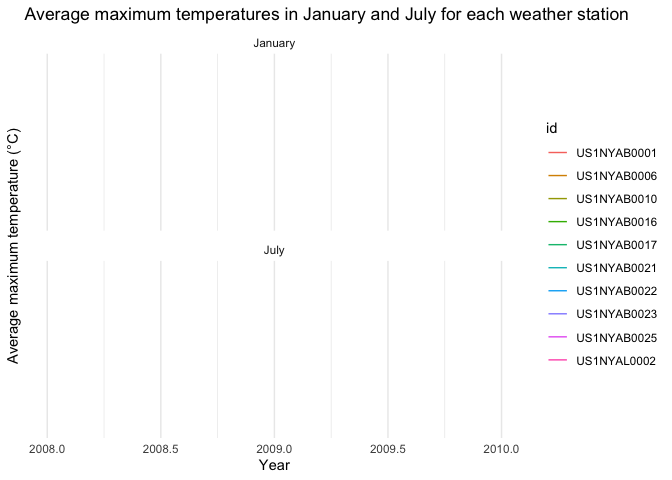
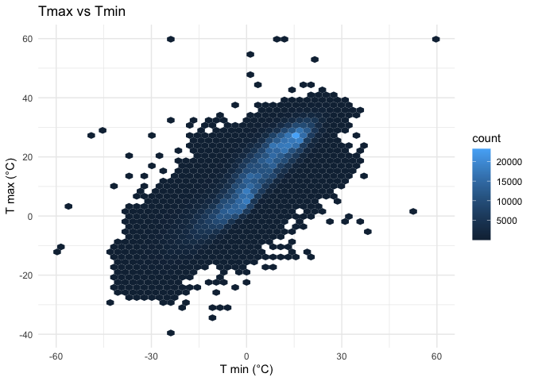
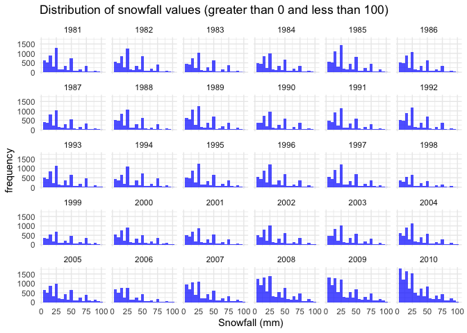
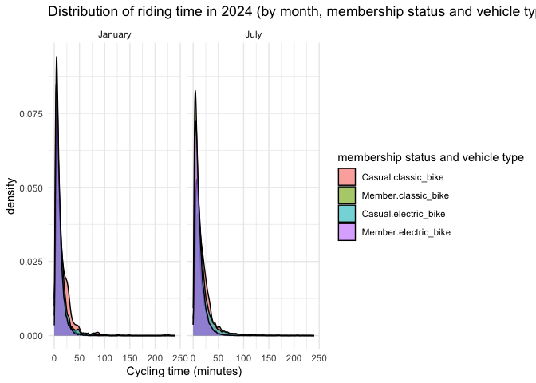

p8105_hw3_cr3442
================
Cheng Rao
2024-10-15

First of all, let me explain why I did not submit multiple versions of
the assignment and did not reflect my modification process. It is like
this. I had completed part of my assignment before this week, but did
not commit or push. Last Saturday, my original computer broke down. I
tried to fix the computer during the weekend but failed. For this
reason, I used my classmate’s computer to complete this week’s homework,
so I did not submit the previous modification process (because I can’t
use icloud). And I feel that I can’t submit my code through the push
method that comes with R studio, but need to submit it by manually
adding it on github. I am very sorry for the trouble caused to you in
correcting your homework.

# Problem 1

First, we use the code on the website to import the data, which includes
the IDs of all weather stations in New York State and the data in them.

Then we load the data, describe the size and structure of the dataset,
and find out the missing values.

``` r
load("nynoaadat.RData")

nydat %>% 
  glimpse()
```

    ## Rows: 2,583,805
    ## Columns: 7
    ## $ id   <chr> "US1NYAB0001", "US1NYAB0001", "US1NYAB0001", "US1NYAB0001", "US1N…
    ## $ date <date> 2007-11-01, 2007-11-02, 2007-11-03, 2007-11-04, 2007-11-05, 2007…
    ## $ prcp <dbl> NA, NA, NA, NA, NA, NA, NA, NA, NA, NA, NA, NA, NA, NA, NA, NA, 3…
    ## $ snow <dbl> NA, NA, NA, NA, NA, NA, NA, NA, NA, NA, NA, NA, NA, NA, NA, NA, 3…
    ## $ snwd <dbl> NA, NA, NA, NA, NA, NA, NA, NA, NA, NA, NA, NA, NA, NA, NA, NA, 0…
    ## $ tmax <dbl> NA, NA, NA, NA, NA, NA, NA, NA, NA, NA, NA, NA, NA, NA, NA, NA, N…
    ## $ tmin <dbl> NA, NA, NA, NA, NA, NA, NA, NA, NA, NA, NA, NA, NA, NA, NA, NA, N…

``` r
dim(nydat)
```

    ## [1] 2583805       7

``` r
# Check the number of missing values
nydat %>% 
  summarise(across(everything(), ~sum(is.na(.))))
```

    ## # A tibble: 1 × 7
    ##      id  date   prcp   snow   snwd    tmax    tmin
    ##   <int> <int>  <int>  <int>  <int>   <int>   <int>
    ## 1     0     0 136182 362133 581297 1126957 1127049

We then create separate “year”, “month”, and “day” variables. We make
sure the temperature, precipitation, and snowfall values are in
reasonable units, and finally find the most common snowfall values.

``` r
library(lubridate)
```

    ## 
    ## Attaching package: 'lubridate'

    ## The following objects are masked from 'package:base':
    ## 
    ##     date, intersect, setdiff, union

``` r
nydat <- nydat %>%
  mutate(
    year = year(date),
    month = month(date),
    day = day(date),
    tmax = tmax / 10,    
    tmin = tmin / 10   # Convert to Celsius
  )

# Find the most common snowfall values
nydat %>%
  count(snow) %>%
  arrange(desc(n))
```

    ## # A tibble: 280 × 2
    ##     snow       n
    ##    <dbl>   <int>
    ##  1     0 2015965
    ##  2    NA  362133
    ##  3    25   31026
    ##  4    13   23060
    ##  5    51   18272
    ##  6    76   10174
    ##  7     8   10016
    ##  8     5    9801
    ##  9    38    9204
    ## 10     3    8838
    ## # ℹ 270 more rows

Next we will plot the average maximum temperature for each weather
station in January and July of each year.

``` r
library(ggplot2)

# Average maximum temperature
avg_temp_jan_jul <- nydat %>%
  filter(month %in% c(1, 7)) %>%
  group_by(id, year, month) %>%
  summarise(avg_tmax = mean(tmax, na.rm = TRUE)) %>%
  ungroup()
```

    ## `summarise()` has grouped output by 'id', 'year'. You can override using the
    ## `.groups` argument.

``` r
# Draw a two-panel plot

avg_temp_jan_jul_clean <- avg_temp_jan_jul %>%
  filter(id %in% unique(id)[1:10]) 

ggplot(avg_temp_jan_jul_clean, aes(x = year, y = avg_tmax, color = id)) +
  geom_line() +
  facet_wrap(~month, ncol = 1, labeller = labeller(month = c(`1` = "January", `7` = "July"))) +
  labs(
    title = "Average maximum temperatures in January and July for each weather station",
    x = "Year",
    y = "Average maximum temperature (°C)"
  ) +
  theme_minimal()
```

    ## Warning: Removed 27 rows containing missing values or values outside the scale range
    ## (`geom_line()`).

<!-- -->
Then We plotted a two-panel graph of Tmax vs. Tmin and snowfall
distribution.

``` r
#  T max vs T min
ggplot(nydat, aes(x = tmin, y = tmax)) +
  geom_hex(bins = 50) +
  labs(
    title = "Tmax vs Tmin",
    x = "T min (°C)",
    y = "T max (°C)"
  ) +
  theme_minimal()
```

    ## Warning: Removed 1128872 rows containing non-finite outside the scale range
    ## (`stat_binhex()`).

<!-- -->

``` r
# Distribution of snowfall values greater than 0 and less than 100

snowfall_distribution <- nydat %>%
  filter(snow > 0, snow < 100) %>%
  group_by(year)

ggplot(snowfall_distribution, aes(x = snow)) +
  geom_histogram(binwidth = 5, fill = "blue", alpha = 0.7) +
  facet_wrap(~year) +
  labs(
    title = "Distribution of snowfall values (greater than 0 and less than 100)",
    x = "Snowfall (mm)",
    y = "frequency"
  ) +
  theme_minimal()
```

<!-- -->

# ANSWER

1.Description:

`id`: Weather station ID

`date`: Date of observation

`prcp`: Precipitation (tenths of mm)

`snow`: Snowfall (mm)

`snwd`: Snow depth (mm)

`tmax`: Maximum temperature (tenths of degrees C)

`tmin`: Minimum temperature (tenths of degrees C)

2.In data cleaning, we did the following:

Creating year, month, and day variables: We used the mutate() function
to extract the year, month, and day from the date variable.

Unit conversion: We converted tmax and tmin from 1/10 degrees Celsius to
degrees Celsius.

The most common snowfall value: We counted the frequency of snowfall
using count(snow) and found that 0 is the most common value. This may be
because there is no snowfall in most cases, especially in summer and
autumn.

3.I did not observe any data about the average maximum temperature of
each weather station in January and July each year. I only had the names
of the weather stations. Even if I took the data of several weather
stations, I did not get any data.

4.From the figure, we can see that there is an obvious positive
correlation between tmax and tmin, which is manifested by the fact that
most of the data points are distributed along a positive slope. This
means that when the minimum temperature is higher, the maximum
temperature is usually also higher.

Many years have snowfall amounts concentrated in a smaller range (0-50
mm), meaning that most observed snowfall events are light to moderate.
However, some years have a histogram with higher snowfall amounts (e.g.,
50-100 mm), which may mean that more severe snowfall events occurred in
these years.

# Problem 2

``` r
library(tidyverse)
```

    ## ── Attaching core tidyverse packages ──────────────────────── tidyverse 2.0.0 ──
    ## ✔ forcats 1.0.0     ✔ stringr 1.5.1
    ## ✔ purrr   1.0.2     ✔ tibble  3.2.1
    ## ✔ readr   2.1.5     ✔ tidyr   1.3.1
    ## ── Conflicts ────────────────────────────────────────── tidyverse_conflicts() ──
    ## ✖ dplyr::filter() masks stats::filter()
    ## ✖ dplyr::lag()    masks stats::lag()
    ## ℹ Use the conflicted package (<http://conflicted.r-lib.org/>) to force all conflicts to become errors

``` r
library(readr)
```

To solve this problem, first let us load the two required datasets, and
check them to make sure they are OK.

``` r
getwd()
```

    ## [1] "/Users/raocheng/Desktop/p8105_hw3_cr3442"

``` r
demographics <- read_csv("/Users/raocheng/Desktop/p8105_hw3_cr3442/data/demographics.csv")
```

    ## New names:
    ## Rows: 254 Columns: 5
    ## ── Column specification
    ## ──────────────────────────────────────────────────────── Delimiter: "," chr
    ## (5): ...1, 1 = male, ...3, ...4, 1 = Less than high school
    ## ℹ Use `spec()` to retrieve the full column specification for this data. ℹ
    ## Specify the column types or set `show_col_types = FALSE` to quiet this message.
    ## • `` -> `...1`
    ## • `` -> `...3`
    ## • `` -> `...4`

``` r
accelerometer <- read_csv("/Users/raocheng/Desktop/p8105_hw3_cr3442/data/accelerometer.csv")
```

    ## Rows: 250 Columns: 1441
    ## ── Column specification ────────────────────────────────────────────────────────
    ## Delimiter: ","
    ## dbl (1441): SEQN, min1, min2, min3, min4, min5, min6, min7, min8, min9, min1...
    ## 
    ## ℹ Use `spec()` to retrieve the full column specification for this data.
    ## ℹ Specify the column types or set `show_col_types = FALSE` to quiet this message.

``` r
# Preview the first few rows of each dataset
head(demographics)
```

    ## # A tibble: 6 × 5
    ##   ...1  `1 = male` ...3  ...4  `1 = Less than high school`
    ##   <chr> <chr>      <chr> <chr> <chr>                      
    ## 1 <NA>  2 = female <NA>  <NA>  2 =  High school equivalent
    ## 2 <NA>  <NA>       <NA>  <NA>  3  = More than high school 
    ## 3 <NA>  <NA>       <NA>  <NA>  <NA>                       
    ## 4 SEQN  sex        age   BMI   education                  
    ## 5 62161 1          22    23.3  2                          
    ## 6 62164 2          44    23.2  3

``` r
head(accelerometer)
```

    ## # A tibble: 6 × 1,441
    ##    SEQN  min1  min2  min3  min4   min5   min6  min7   min8    min9  min10  min11
    ##   <dbl> <dbl> <dbl> <dbl> <dbl>  <dbl>  <dbl> <dbl>  <dbl>   <dbl>  <dbl>  <dbl>
    ## 1 62161 1.11  3.12  1.47  0.938 1.60   0.145  2.10  0.509   1.63   1.20   0.947 
    ## 2 62164 1.92  1.67  2.38  0.935 2.59   5.22   2.39  4.90    1.97   3.13   2.77  
    ## 3 62169 5.85  5.18  4.76  6.48  6.85   7.24   6.12  7.48    5.47   6.49   5.14  
    ## 4 62174 5.42  3.48  3.72  3.81  6.85   4.45   0.561 1.61    0.698  2.72   4.85  
    ## 5 62177 6.14  8.06  9.99  6.60  4.57   2.78   7.10  7.25   10.1    7.49   2.72  
    ## 6 62178 0.167 0.429 0.131 1.20  0.0796 0.0487 0.106 0.0653  0.0564 0.0639 0.0909
    ## # ℹ 1,429 more variables: min12 <dbl>, min13 <dbl>, min14 <dbl>, min15 <dbl>,
    ## #   min16 <dbl>, min17 <dbl>, min18 <dbl>, min19 <dbl>, min20 <dbl>,
    ## #   min21 <dbl>, min22 <dbl>, min23 <dbl>, min24 <dbl>, min25 <dbl>,
    ## #   min26 <dbl>, min27 <dbl>, min28 <dbl>, min29 <dbl>, min30 <dbl>,
    ## #   min31 <dbl>, min32 <dbl>, min33 <dbl>, min34 <dbl>, min35 <dbl>,
    ## #   min36 <dbl>, min37 <dbl>, min38 <dbl>, min39 <dbl>, min40 <dbl>,
    ## #   min41 <dbl>, min42 <dbl>, min43 <dbl>, min44 <dbl>, min45 <dbl>, …

Because the demographics data does not meet the requirements for
subsequent operations, we perform some cleaning.

``` r
# Omit the first four rows of data because of the column of age
cleaned_demographics <- read_csv("/Users/raocheng/Desktop/p8105_hw3_cr3442/data/demographics.csv", skip = 4)
```

    ## Rows: 250 Columns: 5
    ## ── Column specification ────────────────────────────────────────────────────────
    ## Delimiter: ","
    ## dbl (5): SEQN, sex, age, BMI, education
    ## 
    ## ℹ Use `spec()` to retrieve the full column specification for this data.
    ## ℹ Specify the column types or set `show_col_types = FALSE` to quiet this message.

``` r
head(cleaned_demographics)
```

    ## # A tibble: 6 × 5
    ##    SEQN   sex   age   BMI education
    ##   <dbl> <dbl> <dbl> <dbl>     <dbl>
    ## 1 62161     1    22  23.3         2
    ## 2 62164     2    44  23.2         3
    ## 3 62169     1    21  20.1         2
    ## 4 62174     1    80  33.9         3
    ## 5 62177     1    51  20.1         2
    ## 6 62178     1    80  28.5         2

``` r
str(cleaned_demographics)
```

    ## spc_tbl_ [250 × 5] (S3: spec_tbl_df/tbl_df/tbl/data.frame)
    ##  $ SEQN     : num [1:250] 62161 62164 62169 62174 62177 ...
    ##  $ sex      : num [1:250] 1 2 1 1 1 1 1 1 2 2 ...
    ##  $ age      : num [1:250] 22 44 21 80 51 80 35 26 17 30 ...
    ##  $ BMI      : num [1:250] 23.3 23.2 20.1 33.9 20.1 28.5 27.9 22.1 22.9 22.4 ...
    ##  $ education: num [1:250] 2 3 2 3 2 2 3 2 NA 3 ...
    ##  - attr(*, "spec")=
    ##   .. cols(
    ##   ..   SEQN = col_double(),
    ##   ..   sex = col_double(),
    ##   ..   age = col_double(),
    ##   ..   BMI = col_double(),
    ##   ..   education = col_double()
    ##   .. )
    ##  - attr(*, "problems")=<externalptr>

Next, it is time to merge these data.

``` r
merged_data <- inner_join(cleaned_demographics, accelerometer, by = "SEQN")

# Check the merged data
head(merged_data)
```

    ## # A tibble: 6 × 1,445
    ##    SEQN   sex   age   BMI education  min1  min2  min3  min4   min5   min6  min7
    ##   <dbl> <dbl> <dbl> <dbl>     <dbl> <dbl> <dbl> <dbl> <dbl>  <dbl>  <dbl> <dbl>
    ## 1 62161     1    22  23.3         2 1.11  3.12  1.47  0.938 1.60   0.145  2.10 
    ## 2 62164     2    44  23.2         3 1.92  1.67  2.38  0.935 2.59   5.22   2.39 
    ## 3 62169     1    21  20.1         2 5.85  5.18  4.76  6.48  6.85   7.24   6.12 
    ## 4 62174     1    80  33.9         3 5.42  3.48  3.72  3.81  6.85   4.45   0.561
    ## 5 62177     1    51  20.1         2 6.14  8.06  9.99  6.60  4.57   2.78   7.10 
    ## 6 62178     1    80  28.5         2 0.167 0.429 0.131 1.20  0.0796 0.0487 0.106
    ## # ℹ 1,433 more variables: min8 <dbl>, min9 <dbl>, min10 <dbl>, min11 <dbl>,
    ## #   min12 <dbl>, min13 <dbl>, min14 <dbl>, min15 <dbl>, min16 <dbl>,
    ## #   min17 <dbl>, min18 <dbl>, min19 <dbl>, min20 <dbl>, min21 <dbl>,
    ## #   min22 <dbl>, min23 <dbl>, min24 <dbl>, min25 <dbl>, min26 <dbl>,
    ## #   min27 <dbl>, min28 <dbl>, min29 <dbl>, min30 <dbl>, min31 <dbl>,
    ## #   min32 <dbl>, min33 <dbl>, min34 <dbl>, min35 <dbl>, min36 <dbl>,
    ## #   min37 <dbl>, min38 <dbl>, min39 <dbl>, min40 <dbl>, min41 <dbl>, …

Next, let’s summarize the data.

``` r
# Count the number of people by education level and gender
summary_table <- merged_data %>%
  group_by(education, sex) %>%
  summarize(count = n(), .groups = 'drop')


print(summary_table)
```

    ## # A tibble: 8 × 3
    ##   education   sex count
    ##       <dbl> <dbl> <int>
    ## 1         1     1    28
    ## 2         1     2    29
    ## 3         2     1    37
    ## 4         2     2    23
    ## 5         3     1    56
    ## 6         3     2    59
    ## 7        NA     1    10
    ## 8        NA     2     8

Then visualize the data.

``` r
# Draw the age distribution graph with clear gender labels
ggplot(merged_data, aes(x = age, fill = as.factor(sex))) +
  geom_histogram(bins = 30, alpha = 0.6, position = "identity") +
  facet_wrap(~ education) +
  labs(title = "Age Distribution by Gender and Education Level",
       x = "Age", y = "Count", fill = "Gender") +
  scale_fill_manual(values = c("1" = "blue", "2" = "red"),
                    labels = c("Male", "Female")) +
  theme_minimal()
```

<!-- -->

Analysis:

Educational category 1: has a high distribution in both younger (around
20 years old) and older (70-80 years old) groups, with a relatively
balanced gender distribution, but slightly more women in some specific
age groups (such as around 50 years old).

Educational category 2: The age distribution at this education level is
relatively scattered, and the proportion of men and women in different
age groups is not much different. This category is also highly
distributed in the older age group (70-80 years old).

Educational category 3: has a significantly higher distribution in the
younger population (20-30 years old), and there are more men than women.
There are also more participants in the 60-70 age group. This may
indicate that this education level is more common in the younger group.

Overall, the distribution of men and women at different education levels
is roughly the same, but there are some subtle differences. For example,
in education category 1, there are significantly more women than men
around 50 years old, while there are more men in education category 3 in
the 20-30 age group.

There seems to be some correlation between education level and age
distribution, which may be due to individuals in certain age groups
being more inclined to certain education levels.

The accelerometer data contains minute-by-minute activity data for 24
hours, and we need to summarize the activity for each participant.

``` r
# Summarize the total activity for each participant
total_activity <- merged_data %>%
  rowwise() %>%
  mutate(total_activity = sum(c_across(starts_with("MIMS")), na.rm = TRUE)) %>%
  ungroup()
```

Then we will plot a scatter plot of each participant’s total activity
versus age, distinguishing between gender and education level.

``` r
# Plot the relationship between total activity and age
ggplot(total_activity, aes(x = age, y = total_activity, color = as.factor(sex))) +
  geom_point(alpha = 0.6) +
  geom_smooth(method = "loess", se = FALSE) +
  facet_wrap(~ education) +
  labs(title = "Total Activity vs Age by Gender and Education Level",
       x = "Age", y = "Total Activity", color = "Gender") +
  scale_color_manual(values = c("1" = "blue", "2" = "red"), labels = c("Male", "Female")) +
  theme_minimal()
```

    ## `geom_smooth()` using formula = 'y ~ x'

    ## Warning in simpleLoess(y, x, w, span, degree = degree, parametric = parametric,
    ## : pseudoinverse used at 16.99

    ## Warning in simpleLoess(y, x, w, span, degree = degree, parametric = parametric,
    ## : neighborhood radius 1.01

    ## Warning in simpleLoess(y, x, w, span, degree = degree, parametric = parametric,
    ## : reciprocal condition number 0

    ## Warning in simpleLoess(y, x, w, span, degree = degree, parametric = parametric,
    ## : There are other near singularities as well. 4.0401

    ## Warning in simpleLoess(y, x, w, span, degree = degree, parametric = parametric,
    ## : pseudoinverse used at 15.995

    ## Warning in simpleLoess(y, x, w, span, degree = degree, parametric = parametric,
    ## : neighborhood radius 1.005

    ## Warning in simpleLoess(y, x, w, span, degree = degree, parametric = parametric,
    ## : reciprocal condition number 0

    ## Warning in simpleLoess(y, x, w, span, degree = degree, parametric = parametric,
    ## : There are other near singularities as well. 1.01

<!-- -->

Analysis: Gender and education differences do not appear to be
significant.

Finally, create a three-panel plot showing the 24-hour activity time
trajectory for each education level, color-coded by gender.

``` r
# Convert activity data for each minute within 24 hours to long format
activity_long <- merged_data %>%
  pivot_longer(cols = starts_with("min"), names_to = "minute", values_to = "activity") %>%
  mutate(minute = as.numeric(gsub("min", "", minute)))

# Draw 24-hour activity trajectory
ggplot(activity_long, aes(x = minute, y = activity, color = sex)) +
  geom_smooth(se = FALSE) +
  facet_wrap(~ education) +
  labs(title = "24-hour activity time trajectory by education level",
       x = "Minutes of the Day", y = "Activity Level", color = "gender") +
  theme_minimal()
```

    ## `geom_smooth()` using method = 'gam' and formula = 'y ~ s(x, bs = "cs")'

    ## Warning: The following aesthetics were dropped during statistical transformation:
    ## colour.
    ## ℹ This can happen when ggplot fails to infer the correct grouping structure in
    ##   the data.
    ## ℹ Did you forget to specify a `group` aesthetic or to convert a numerical
    ##   variable into a factor?
    ## The following aesthetics were dropped during statistical transformation:
    ## colour.
    ## ℹ This can happen when ggplot fails to infer the correct grouping structure in
    ##   the data.
    ## ℹ Did you forget to specify a `group` aesthetic or to convert a numerical
    ##   variable into a factor?
    ## The following aesthetics were dropped during statistical transformation:
    ## colour.
    ## ℹ This can happen when ggplot fails to infer the correct grouping structure in
    ##   the data.
    ## ℹ Did you forget to specify a `group` aesthetic or to convert a numerical
    ##   variable into a factor?
    ## The following aesthetics were dropped during statistical transformation:
    ## colour.
    ## ℹ This can happen when ggplot fails to infer the correct grouping structure in
    ##   the data.
    ## ℹ Did you forget to specify a `group` aesthetic or to convert a numerical
    ##   variable into a factor?

<!-- -->

Analysis: The chart shows the age distribution of men (red) and women
(blue) at different education levels.

In the case of education level 1, the age distribution is relatively
wide, with a relatively balanced distribution from 20 to 80 years old.
The distribution of men and women is similar in all age groups, but
there are more women in the higher age groups (70-80 years old).

In the case of education level 2, the age distribution is more
dispersed, covering multiple age groups, and the ratio between men and
women is not much different in most age groups.

In the case of education level 3, there is a clear peak in the age group
of 20-30 years old, especially the higher proportion of men, indicating
that young people are more in this education level.

The number of participants gradually decreases with age, but it is worth
noting that there is another smaller peak in the age group of 60-70
years old.

# Problem 3

``` r
library(tidyverse)
library(lubridate)
```

To solve this problem, first let us load the four required datasets, and
check them to make sure they are OK.

``` r
setwd("/Users/raocheng/Desktop/p8105_hw3_cr3442")
getwd()
```

    ## [1] "/Users/raocheng/Desktop/p8105_hw3_cr3442"

``` r
Jan_2020_Citi <- read_csv("/Users/raocheng/Desktop/p8105_hw3_cr3442/data/Jan_2020_Citi.csv")
```

    ## Rows: 12420 Columns: 7
    ## ── Column specification ────────────────────────────────────────────────────────
    ## Delimiter: ","
    ## chr (6): ride_id, rideable_type, weekdays, start_station_name, end_station_n...
    ## dbl (1): duration
    ## 
    ## ℹ Use `spec()` to retrieve the full column specification for this data.
    ## ℹ Specify the column types or set `show_col_types = FALSE` to quiet this message.

``` r
Jan_2024_Citi <- read_csv("/Users/raocheng/Desktop/p8105_hw3_cr3442/data/Jan_2024_Citi.csv")
```

    ## Rows: 18861 Columns: 7
    ## ── Column specification ────────────────────────────────────────────────────────
    ## Delimiter: ","
    ## chr (6): ride_id, rideable_type, weekdays, start_station_name, end_station_n...
    ## dbl (1): duration
    ## 
    ## ℹ Use `spec()` to retrieve the full column specification for this data.
    ## ℹ Specify the column types or set `show_col_types = FALSE` to quiet this message.

``` r
July_2020_Citi <- read_csv("/Users/raocheng/Desktop/p8105_hw3_cr3442/data/July_2020_Citi.csv")
```

    ## Rows: 21048 Columns: 7
    ## ── Column specification ────────────────────────────────────────────────────────
    ## Delimiter: ","
    ## chr (6): ride_id, rideable_type, weekdays, start_station_name, end_station_n...
    ## dbl (1): duration
    ## 
    ## ℹ Use `spec()` to retrieve the full column specification for this data.
    ## ℹ Specify the column types or set `show_col_types = FALSE` to quiet this message.

``` r
July_2024_Citi <- read_csv("/Users/raocheng/Desktop/p8105_hw3_cr3442/data/July_2024_Citi.csv")
```

    ## Rows: 47156 Columns: 7
    ## ── Column specification ────────────────────────────────────────────────────────
    ## Delimiter: ","
    ## chr (6): ride_id, rideable_type, weekdays, start_station_name, end_station_n...
    ## dbl (1): duration
    ## 
    ## ℹ Use `spec()` to retrieve the full column specification for this data.
    ## ℹ Specify the column types or set `show_col_types = FALSE` to quiet this message.

``` r
# Preview the first few rows of each dataset
head(Jan_2020_Citi)
```

    ## # A tibble: 6 × 7
    ##   ride_id    rideable_type weekdays duration start_station_name end_station_name
    ##   <chr>      <chr>         <chr>       <dbl> <chr>              <chr>           
    ## 1 4BE06CB33… classic_bike  Tuesday     15.3  Columbus Ave & W … E 53 St & Madis…
    ## 2 26886E034… classic_bike  Wednesd…     5.31 2 Ave & E 96 St    1 Ave & E 110 St
    ## 3 24DC56060… classic_bike  Friday       9.69 Columbia St & Riv… Grand St & Eliz…
    ## 4 EEDC10535… classic_bike  Sunday       7.00 W 84 St & Columbu… Columbus Ave & …
    ## 5 2CD4BD4CE… classic_bike  Friday       2.85 Forsyth St & Broo… Suffolk St & St…
    ## 6 E18682F9A… classic_bike  Sunday      25.5  Allen St & Hester… Atlantic Ave & …
    ## # ℹ 1 more variable: member_casual <chr>

``` r
head(Jan_2024_Citi)
```

    ## # A tibble: 6 × 7
    ##   ride_id    rideable_type weekdays duration start_station_name end_station_name
    ##   <chr>      <chr>         <chr>       <dbl> <chr>              <chr>           
    ## 1 644A0105A… electric_bike Wednesd…    16.5  Lafayette St & Je… W 50 St & 9 Ave 
    ## 2 A5A8C0AD1… electric_bike Wednesd…     6.29 Clinton St & Till… Duffield St & W…
    ## 3 B392CE349… electric_bike Tuesday      6.12 West End Ave & W … W 116 St & Broa…
    ## 4 33756EDC7… electric_bike Wednesd…    10.9  Grand St & Elizab… Front St & Jay …
    ## 5 29D9AF64D… electric_bike Thursday     8.42 12 Ave & W 40 St   Washington St &…
    ## 6 C7E61191A… electric_bike Sunday      18.5  7 Ave & Central P… 44 Dr & Jackson…
    ## # ℹ 1 more variable: member_casual <chr>

``` r
head(July_2020_Citi)
```

    ## # A tibble: 6 × 7
    ##   ride_id    rideable_type weekdays duration start_station_name end_station_name
    ##   <chr>      <chr>         <chr>       <dbl> <chr>              <chr>           
    ## 1 A7503F194… classic_bike  Sunday       9.86 Franklin Ave & Em… Grand Army Plaz…
    ## 2 B47EBE0EA… classic_bike  Monday       8.29 E 33 St & 1 Ave    E 33 St & 5 Ave 
    ## 3 8146F6C68… classic_bike  Wednesd…     5.39 George St & Wilso… Willoughby Ave …
    ## 4 D49560E33… classic_bike  Saturday    19.2  St. Nicholas Ave … Willis Ave & E …
    ## 5 87687AAE4… classic_bike  Tuesday     26.4  Front St & Jay St  Grand St & Eliz…
    ## 6 E30DFCD98… classic_bike  Sunday      51.9  Clinton St & Jora… Myrtle Ave & Li…
    ## # ℹ 1 more variable: member_casual <chr>

``` r
head(July_2024_Citi)
```

    ## # A tibble: 6 × 7
    ##   ride_id    rideable_type weekdays duration start_station_name end_station_name
    ##   <chr>      <chr>         <chr>       <dbl> <chr>              <chr>           
    ## 1 86AE148E3… classic_bike  Sunday      19.7  Picnic Point       Yankee Ferry Te…
    ## 2 FCF07A30F… electric_bike Thursday     7.68 W 54 St & 9 Ave    W 42 St & 8 Ave 
    ## 3 D8397E843… classic_bike  Thursday    24.5  12 Ave & W 40 St   W 84 St & Amste…
    ## 4 E575690C1… electric_bike Tuesday      3.53 Grand St & Haveme… S 4 St & Rodney…
    ## 5 184AABED4… electric_bike Wednesd…    24.1  Broadway & Kent A… Henry St & Degr…
    ## 6 ACA61A92B… classic_bike  Saturday     7.83 E 1 St & 1 Ave     Mercer St & Spr…
    ## # ℹ 1 more variable: member_casual <chr>

Then merge them.

``` r
# Merge all datasets
citi_bike_data <- bind_rows(
  Jan_2020_Citi %>% mutate(year = 2020, month = "January"),
  July_2020_Citi %>% mutate(year = 2020, month = "July"),
  Jan_2024_Citi %>% mutate(year = 2024, month = "January"),
  July_2024_Citi %>% mutate(year = 2024, month = "July")
)

head(citi_bike_data)
```

    ## # A tibble: 6 × 9
    ##   ride_id    rideable_type weekdays duration start_station_name end_station_name
    ##   <chr>      <chr>         <chr>       <dbl> <chr>              <chr>           
    ## 1 4BE06CB33… classic_bike  Tuesday     15.3  Columbus Ave & W … E 53 St & Madis…
    ## 2 26886E034… classic_bike  Wednesd…     5.31 2 Ave & E 96 St    1 Ave & E 110 St
    ## 3 24DC56060… classic_bike  Friday       9.69 Columbia St & Riv… Grand St & Eliz…
    ## 4 EEDC10535… classic_bike  Sunday       7.00 W 84 St & Columbu… Columbus Ave & …
    ## 5 2CD4BD4CE… classic_bike  Friday       2.85 Forsyth St & Broo… Suffolk St & St…
    ## 6 E18682F9A… classic_bike  Sunday      25.5  Allen St & Hester… Atlantic Ave & …
    ## # ℹ 3 more variables: member_casual <chr>, year <dbl>, month <chr>

Next, we need to clean and organize the data.

``` r
# Clean and organize data
citi_bike_data_cleaned <- citi_bike_data %>%
  mutate(day_of_week = weekdays,  # Use existing weekday column
         duration_minutes = duration,  
         member_casual = ifelse(member_casual == "member", "Member", "Casual")) %>%
  drop_na()  

# check the cleaned data
head(citi_bike_data_cleaned)
```

    ## # A tibble: 6 × 11
    ##   ride_id    rideable_type weekdays duration start_station_name end_station_name
    ##   <chr>      <chr>         <chr>       <dbl> <chr>              <chr>           
    ## 1 4BE06CB33… classic_bike  Tuesday     15.3  Columbus Ave & W … E 53 St & Madis…
    ## 2 26886E034… classic_bike  Wednesd…     5.31 2 Ave & E 96 St    1 Ave & E 110 St
    ## 3 24DC56060… classic_bike  Friday       9.69 Columbia St & Riv… Grand St & Eliz…
    ## 4 EEDC10535… classic_bike  Sunday       7.00 W 84 St & Columbu… Columbus Ave & …
    ## 5 2CD4BD4CE… classic_bike  Friday       2.85 Forsyth St & Broo… Suffolk St & St…
    ## 6 E18682F9A… classic_bike  Sunday      25.5  Allen St & Hester… Atlantic Ave & …
    ## # ℹ 5 more variables: member_casual <chr>, year <dbl>, month <chr>,
    ## #   day_of_week <chr>, duration_minutes <dbl>

Generate a summary table showing the total number of rides for members
and non-members per month of each year.

``` r
ride_summary <- citi_bike_data_cleaned %>%
  group_by(year, month, member_casual) %>%
  summarize(total_rides = n(), .groups = 'drop')

# Generate tabular output
ride_summary_table <- ride_summary %>%
  pivot_wider(names_from = member_casual, values_from = total_rides, values_fill = 0)

print(ride_summary_table)
```

    ## # A tibble: 4 × 4
    ##    year month   Casual Member
    ##   <dbl> <chr>    <int>  <int>
    ## 1  2020 January    980  11418
    ## 2  2020 July      5625  15388
    ## 3  2024 January   2094  16705
    ## 4  2024 July     10843  36200

Find the top 5 most popular starting stations for July 2024 and show the
number of rides from each station.

``` r
# Filter out data from July 2024
july_2024_data <- citi_bike_data_cleaned %>%
  filter(year == 2024, month == "July")

# Find the most popular starting stations
top_start_stations <- july_2024_data %>%
  group_by(start_station_name) %>%
  summarize(total_rides = n(), .groups = 'drop') %>%
  arrange(desc(total_rides)) %>%
  slice_head(n = 5)

print(top_start_stations)
```

    ## # A tibble: 5 × 2
    ##   start_station_name       total_rides
    ##   <chr>                          <int>
    ## 1 Pier 61 at Chelsea Piers         163
    ## 2 University Pl & E 14 St          155
    ## 3 W 21 St & 6 Ave                  152
    ## 4 West St & Chambers St            150
    ## 5 W 31 St & 7 Ave                  145

Next, plot a graph to see how the median duration of a ride changes by
week, month, and year.

``` r
# Calculate the median riding time for each group
median_ride_duration <- citi_bike_data_cleaned %>%
  group_by(year, month, day_of_week) %>%
  summarize(median_duration = median(duration_minutes), .groups = 'drop')

# Draw a chart
ggplot(median_ride_duration, aes(x = day_of_week, y = median_duration, fill = month)) +
  geom_bar(stat = "identity", position = "dodge") +
  facet_wrap(~ year) +
  labs(title = "Median cycling duration by week, month, and year",
       x = "week", y = "Median riding time (minutes)", fill = "month") +
  theme_minimal()
```

<!-- -->

Analysis: For 2020: July rides were significantly longer than January,
especially on weekends (Saturday and Sunday). This may reflect the
increase in cycling in the summer months (July), when cyclists may
choose to go outdoors more often. July rides peaked from Friday to
Sunday, especially on Saturday and Sunday, where the median ride time
exceeded 15 minutes, indicating that more people may use their weekends
for longer rides. January rides were relatively short and less variable,
indicating that the cold weather kept people from going out to ride,
especially in 2020. For 2024: Compared to 2020, the overall ride time in
2024 was lower. Both January and July had relatively low peak ride
times. However, the difference between January and July was not as
significant in 2024 as in 2020. Although July ride time was still
slightly higher than January, the difference between the two was
smaller. Moreover, in 2024, the ride time from Friday to Sunday tended
to be stable and decreased compared to 2020.

Finally, Let us draw a chart to show the impact of month, member status
and vehicle type on the distribution of riding time in the 2024 data.

``` r
# Filter data of 2024
data_2024 <- citi_bike_data_cleaned %>%
  filter(year == 2024)

# Plotting the distribution of riding time
ggplot(data_2024, aes(x = duration_minutes, fill = interaction(member_casual, rideable_type))) +
  geom_density(alpha = 0.6) +
  facet_wrap(~ month) +
  labs(title = "Distribution of riding time in 2024 (by month, membership status and vehicle type)",
       x = "Cycling time (minutes)", y = "density", fill = "membership status and vehicle type") +
  theme_minimal() +
  xlim(0, 240) 
```

<!-- -->

Analysis:

Most of the rides are short, concentrated between 0 and 50 minutes,
while longer rides (over 100 minutes) are very rare. This right-skewed
distribution pattern is consistent in two months (January and July),
with a clear peak, showing that most rides are concentrated in the
shorter range.

The distribution pattern of classic bikes and electric bikes is similar.
Although the specific differences are not big, in general, the riding
time of electric bikes (especially members) is slightly longer. This may
be because electric bikes are more labor-saving. If I were in the same
situation, I would also prefer electric bikes.

Non-members ride slightly longer than members, which may be related to
the fact that non-members tend to use rental services for longer
sightseeing activities, while members may mainly use them for
short-distance commuting, and non-members need to ride for a long time
to make their investment back. The use of electric bicycles is more
obvious among members, especially in shorter rides, which may be due to
the fact that electric bicycles are more efficient in daily commuting.
